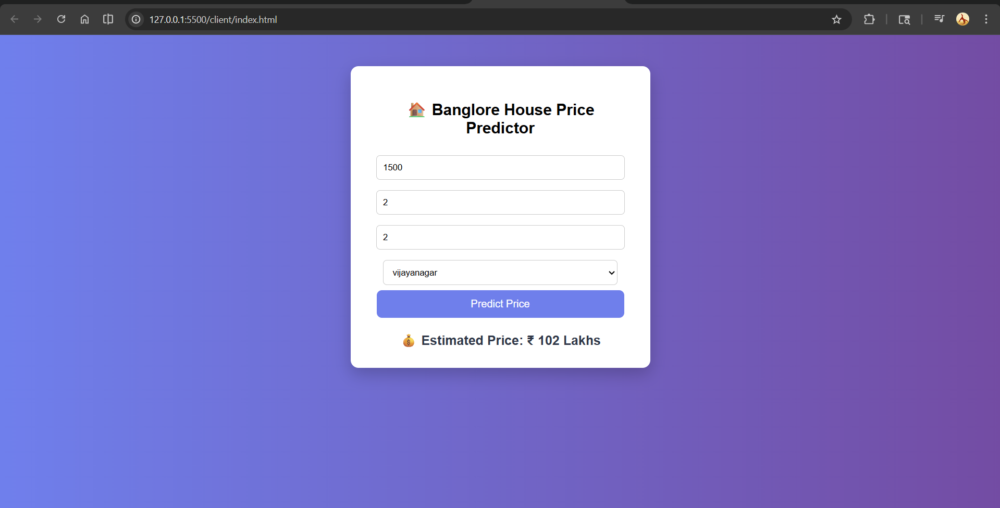
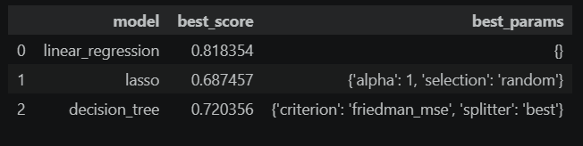

# 🏠 Bangalore House Price Prediction
A Machine Learning project that predicts house prices in Bangalore based on features like area, BHK, bathrooms, and location.
## 📸 Web Application Demo

### 🔹 Input Interface

  

### 🔹 Prediction Result

  

## 🎯 Problem Statement

Real estate price prediction is a complex problem influenced by multiple factors such as location, area, and amenities. This project aims to build a machine learning model that can accurately estimate house prices in Bangalore.

## 📊 Dataset

- Source: Bengaluru House Data
- Features:
  - area_type
  - availability
  - location
  - size (BHK)
  - total_sqft
  - bath
  - balcony
  - price
- Total rows: ~10,000+

## 🛠️ Tech Stack

## 🛠️ Tech Stack

- **Programming:** Python  
- **Libraries:** Pandas, NumPy, Scikit-learn  
- **Backend:** Flask  
- **Frontend:** HTML, CSS, JavaScript  

## 🔧 Data Preprocessing

- Removed unnecessary columns: 
  - area_type
  - availability
  - society
  - balcony
- Converted "size" → BHK (numeric)
- Handled missing values
- Removed outliers
- Created price_per_sqft feature
- One-hot encoding for location

## ⚙️ Model Building

We tested multiple machine learning models using GridSearchCV:

- Linear Regression
- Lasso Regression
- Decision Tree

## 📈 Model Evaluation

👉 Linear Regression achieved the highest performance (~81% R² score), outperforming Lasso and Decision Tree models.

This suggests a strong linear relationship between input features and house prices in the dataset.

## 🌐 Web Application

- Frontend: HTML, CSS
- Backend: Flask (Python)
- Model served using REST API

Users can:
✔ Enter area, BHK, bath, location  
✔ Get predicted house price instantly  

## 💡 Key Learnings

- Data cleaning is crucial for ML performance
- Feature engineering improves accuracy
- Linear Regression works well for structured data
- Cross-validation helps avoid overfitting
- End-to-end ML project (data → model → UI)

## 📌 Future Work

- Add more features (amenities, location clustering)
- Use advanced models (XGBoost)
- Deploy on cloud
- Improve UI/UX