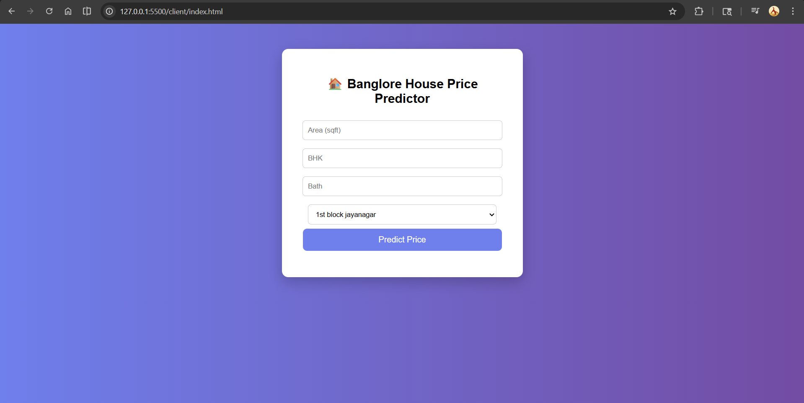

# 🏠 Bangalore House Price Prediction
A Machine Learning project that predicts house prices in Bangalore based on features like area, BHK, bathrooms, and location.
## 📸 Project Demo

## 🎯 Problem Statement

Real estate price prediction is a complex problem influenced by multiple factors such as location, area, and amenities. This project aims to build a machine learning model that can accurately estimate house prices in Bangalore.

## 📊 Dataset

- Source: Bengaluru House Data
- Features:
  - area_type
  - availability
  - location
  - size (BHK)
  - total_sqft
  - bath
  - balcony
  - price
- Total rows: ~10,000+

## 🔧 Data Preprocessing

- Removed unnecessary columns:
- area_type, availability, society, balcony
- Converted "size" → BHK (numeric)
- Handled missing values
- Removed outliers
- Created price_per_sqft feature
- One-hot encoding for location